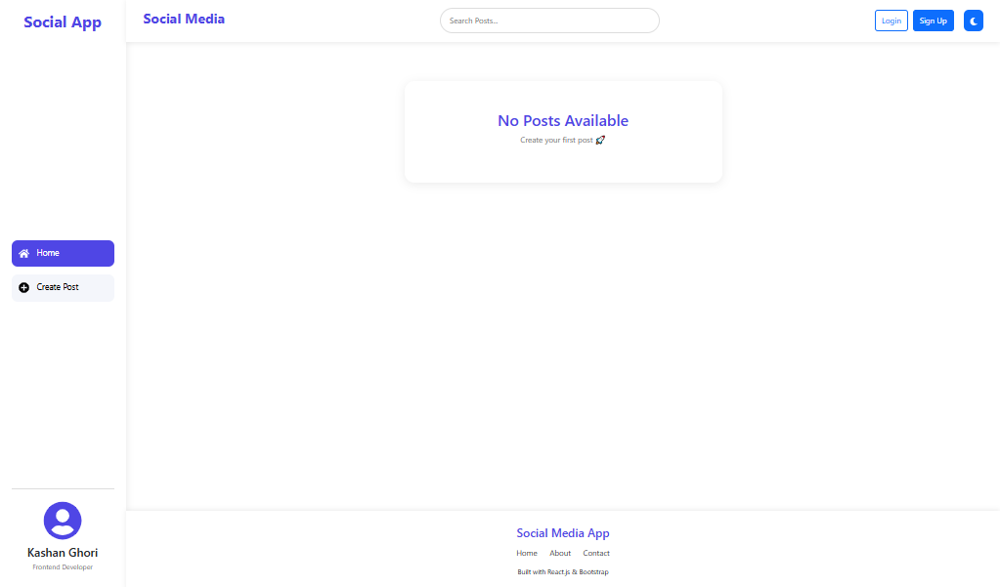
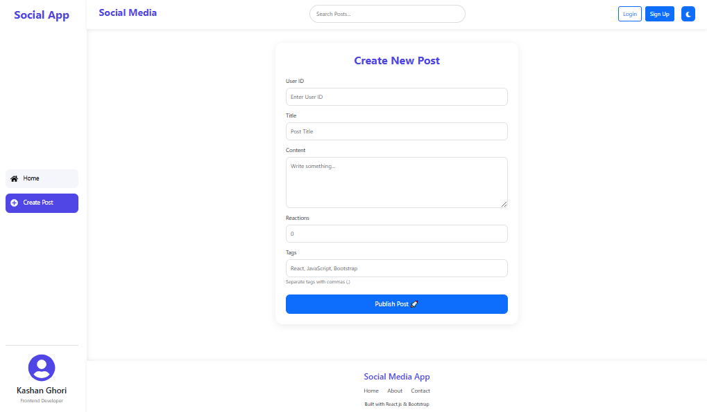
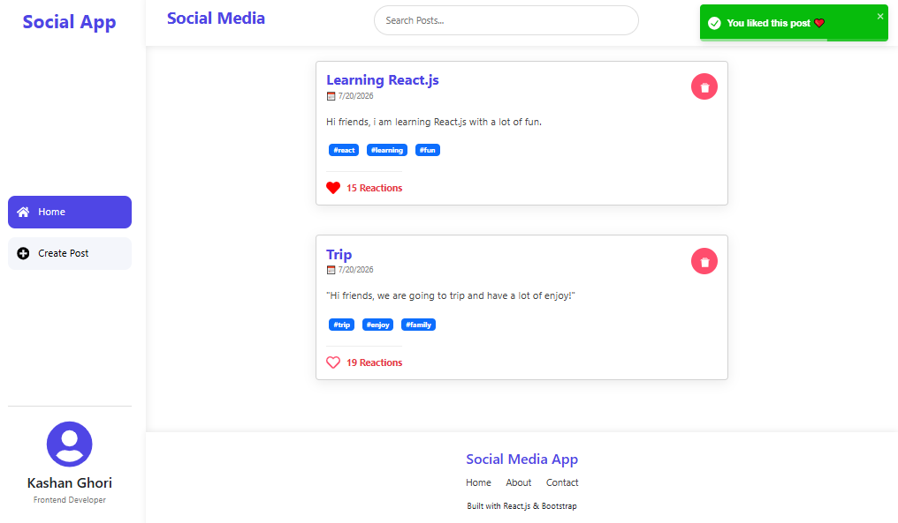
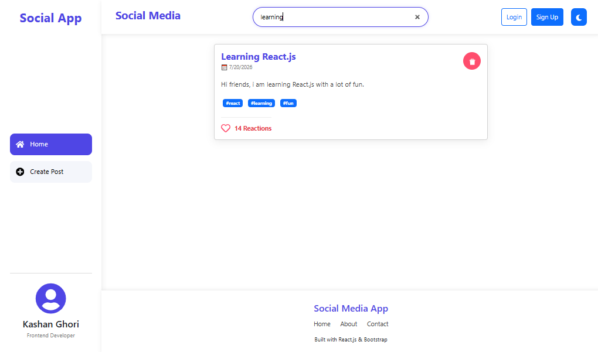
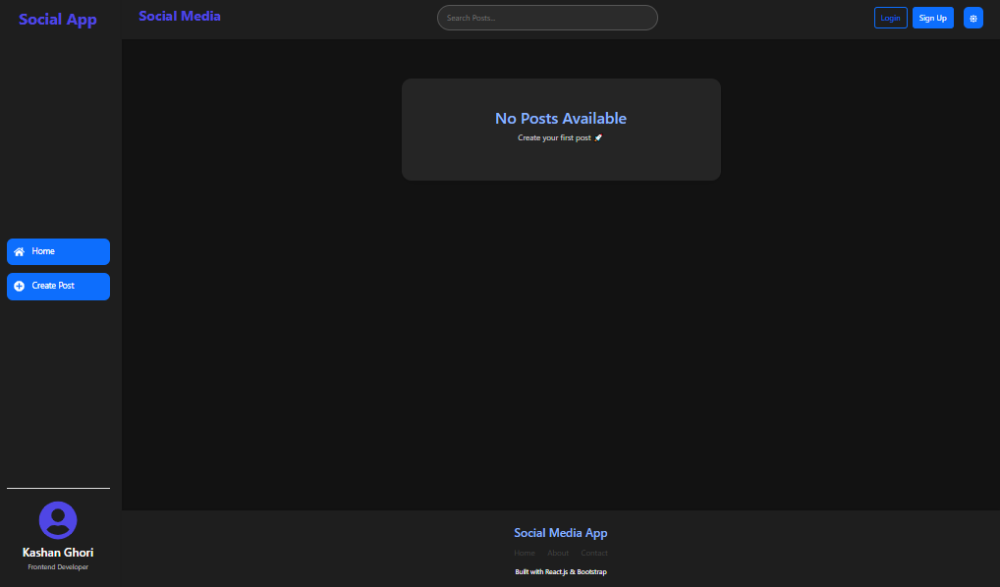
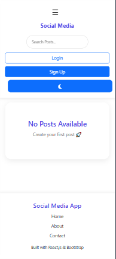

# 📱 React Social Media App


---

# 📖 Project Overview

A modern and responsive **Social Media Application** developed using **React.js** and **Vite**.

The application allows users to create posts, search posts instantly, like/unlike posts, delete posts, switch between Light/Dark themes, and automatically save data using Local Storage.

The project follows a clean component-based architecture and uses **Context API** with **useReducer** for global state management.

---

# Preview



---

[🔗Live Demo](https://kg-se.github.io/social-media-app/)

---

# 📸 Screenshots

## ➕ Create Post



---

## 👍 Like Fearure



---

## 🔍 Search Feature



---

## 🌙 Dark Mode



---

## 📱 Mobile Responsive



---

# ✨ Features

## 📝 Post Management

- Create New Posts
- Delete Existing Posts
- Instant UI Update

---

## ❤️ Like System

- Like Post
- Unlike Post
- Dynamic Reaction Counter

---

## 🔍 Smart Search

- Search by Title
- Search by Post Content
- Instant Filtering

---

## 🌙 Dark Mode

- One Click Theme Switching
- Modern Dark UI
- Persistent Theme

---

## 💾 Local Storage

- Posts automatically saved
- Data remains after page refresh

---

## 🔔 Toast Notifications

- Post Created
- Post Deleted
- Post Liked
- Like Removed

---

## 📱 Fully Responsive

- Desktop Layout
- Tablet Support
- Mobile Friendly Sidebar

---

## ⚡ Modern UI

- Card Design
- Hover Effects
- Smooth Animations
- Professional Layout

---

# 🛠 Technologies Used

- React.js
- Vite
- JavaScript (ES6+)
- Bootstrap 5
- CSS3
- React Icons
- React Toastify
- Local Storage

---

# 📂 Folder Structure

```
social-media-app
│
│──src
│   │
│   │──components
│   │     ├── Header.jsx
│   │     ├── Footer.jsx
│   │     ├── Sidebar.jsx
│   │     ├── Post.jsx
│   │     ├── PostList.jsx
│   │     └── CreatePost.jsx
│   │     ├── store
│   │           └── post-list-store.jsx
│   │
│   ├── App.jsx
│   ├── App.css
│   └── main.jsx
│
│──screenshots
│      │
│      │──home.png
│      │──create.png
│      │──like.png
│      │──search.png
│      │──dark.png
│      │──mobile.png
│

```

---

💡 This project helped me improve my react concepts.

---

## 🤝 Connect with Me

Feel free to connect with me on LinkedIn and check out my projects!

⭐ If you like this project, don't forget to star the repository!

[🔗Linkedin](https://www.linkedin.com/in/kashan-ghori-9b50b43b4)

[🔗GitHub](https://github.com/KG-SE)

---

## 👨‍💻 Author

**Kashan Ghori**
